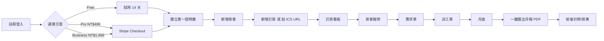

# hotel-pm-pro · PRD v3.0.2 等級規格書

> 自動生成：2026-09-06
> 對齊 SPEC v3.0 契約（SPEC §1–§19 全部套用）
> Repo：`openclawsean024-create/hotel-pm-pro`
> Stack：Next.js 16.2.12 (App Router) + React 19.2.4 + Prisma 5.22 + Postgres (Supabase) + NextAuth 5 beta + Stripe 22.4 + Zod 4 + Tailwind v3

---

## 0. 文件資訊 (Document Info)

| 欄位 | 值 |
|---|---|
| 專案名稱 | hotel-pm-pro（民宿管家商業版） |
| 文件版本 | **v3.0.2**（Fleet 升級版，2026-09-06） |
| 前一版本 | v3.0（2026-08，原始自由版本） |
| 維護者 | Sean Li |
| 文件狀態 | ✅ shipped |
| 部署目標 | Vercel（Next.js App Router） |
| 預設分支 | `main` |
| 升級原因 | Sean 10-repo-fleet Batch 6C — 補 §16 部署契約 + 規格書正規化 |

---

## 1. 產品概述

### 1.1 問題陳述

台灣民宿 / 包租代管業者目前面臨 4 大痛點：

1. **商用 PMS 太貴**：Cloudbeds 國際版月費 US$250+（約 NT$7,500+）、Hoteliers.com 月費 NT$3,000+、本土飯店系統一套要 NT$30 萬+。對月營業額 <NT$50 萬的民宿業者，工具成本吃光淨利。
2. **Excel 自製不友善**：能做但無法多人協作、ICS 訂房要手動 key、月報表要手動樞紐。
3. **跨平台訂房匯入痛**：Airbnb / Booking.com / Agoda 三平台訂房，要逐一到後台查詢並手動輸入。
4. **稅務 / 拆帳亂**：房東分潤要手寫計算、會計師要的月報表要手動製作。

**核心觀察**：台灣 <30 間房的小型民宿 / 包租代管佔整體民宿 87%（交通部觀光署 2025 統計），但 95% 仍用 Excel / 手寫管理。

### 1.2 目標使用者

| Persona | 規模 | 工作情境 | 主要任務 | 願付價格 |
|---|---|---|---|---|
| **Primary — 民宿老闆**（5-15 房） | 5,000+ | 每天接訂房、處理房客、清潔派工 | 統一管理多平台訂房、月報表、稅務 | NT$499-999/月 |
| **Secondary — 包租代管業者**（管 30-100 房東） | 500+ | 多物業管理、房東拆帳、維修派工 | 多物業儀表板、房東分潤、維修追蹤 | NT$1,999/月（Business） |
| **Tertiary — 旅居品牌經營者**（多品牌） | 200+ | 跨品牌 KPI 對比、財務彙整 | 跨物業 KPI、品牌儀表板 | 客製報價 |

### 1.3 核心價值主張

> 「**一套 PMS 管所有民宿事** — 物業 / 房客 / 訂房 / 需求 / 維修 / 月報 + 自動 ICS 同步 + Stripe 訂閱，月費 NT$499 起，比 Cloudbeds 便宜 80%。」

**三大差異化**：
1. **ICS 自動匯入**：解析 Airbnb / Booking.com 行事曆連結，去重匯入到訂房看板，10 秒鐘搞定
2. **多物業 / 多房東拆帳**：包租代管業者可同時管 30-100 個物業，自動計算房東分潤
3. **純本地化 + Stripe 訂閱**：繁中 UI、台灣稅務邏輯、Stripe Checkout 訂閱（不綁年約）

### 1.4 Non-Goals（明確不做）

- ❌ **不做 OTA channel manager**（PMS 接收訂房即可，不主動推送房型/房價到 Airbnb/Booking.com）— Channel manager 整合太複雜，v2 評估
- ❌ **不做硬體整合**（門鎖/出單印表機/PMS 鍵盤）— v3+ 評估
- ❌ **不做國際化**（先繁中，未來加英文/簡中/日文）— v2 評估
- ❌ **不做行動 App**（響應式網頁已足夠）— v3+ 評估
- ❌ **不做飯店集團級功能**（多品牌 POS 整合、CRM 完整）— 鎖定民宿/包租代管，不切飯店集團市場

---

## 2. 使用者場景與流程

### 2.1 使用者流程圖



### 2.2 主要場景

| 場景 | 輸入 | 輸出 | 成功條件 |
|---|---|---|---|
| **S-01 註冊** | Email + 密碼 | Auth.js v5 帳號 + 14 天 Free trial | 自動登入 + 導向 `/dashboard` |
| **S-02 建立物業** | 地址、房型、坪數、月租金、房東分潤 % | 物業列表新增 1 筆 | 列表即時顯示 + URL slug 自動產生 |
| **S-03 新增房客** | 姓名、Email、月租起訖、押金 | 房客 CRM 1 筆 + 月繳提醒排程 | Email 確認信寄出 + 提醒加入排程 |
| **S-04 ICS 自動匯入** | 貼上 Airbnb/Booking ICS URL | 解析後匯入到訂房看板，自動去重 | 重複的 UID 不會重複建立 |
| **S-05 房東月報表** | 選擇月份 + 物業 | 該月 PDF 報表（營業額、訂房數、房東分潤） | PDF 包含拆帳金額，可直接寄給房東 |
| **S-06 升級方案** | 點選「升級 Pro / Business」 | Stripe Checkout 開新分頁 | Webhook 回來更新 `User.tier` |

---

## 3. 功能需求 (Functional Requirements)

| FR | 名稱 | 優先級 | 狀態 |
|---|---|---|---|
| FR-001 | Email/密碼註冊（Auth.js v5 Credentials + bcryptjs） | P0 | ✅ shipped |
| FR-002 | 物業 CRUD（地址/房型/坪數/月租金/房東分潤%） | P0 | ✅ shipped |
| FR-003 | 房客 CRM（聯絡方式/租約/押金/月繳提醒） | P0 | ✅ shipped |
| FR-004 | 訂房看板（手動新增 + ICS 自動匯入） | P0 | ✅ shipped |
| FR-005 | ICS 解析器（RFC 5545 subset, 容錯 Airbnb/Booking 格式） | P0 | ✅ shipped |
| FR-006 | 需求單（房客報修，附優先級/狀態） | P0 | ✅ shipped |
| FR-007 | 派工單（廠商/估價/實際費用/起訖日） | P0 | ✅ shipped |
| FR-008 | 月報表 PDF 匯出（含房東分潤拆帳） | P0 | ✅ shipped |
| FR-009 | Stripe Checkout 訂閱（Pro / Business） | P0 | ✅ shipped |
| FR-010 | Stripe Webhook 處理（subscription updated/deleted） | P0 | ✅ shipped |
| FR-011 | NextAuth middleware（保護 `/dashboard/*` 路由） | P0 | ✅ shipped |
| FR-012 | 聯絡表單（站內客服訊息） | P1 | ✅ shipped |
| FR-013 | FAQ / Terms / Privacy / Pricing 頁面 | P1 | ✅ shipped |
| FR-014 | Sitemap / Robots | P1 | ✅ shipped |
| FR-015 | 多物業儀表板（總營業額 / 總訂房數 / 各物業狀態） | P1 | ✅ shipped |

---

## 4. Non-Functional Requirements

| 維度 | 需求 |
|---|---|
| Performance | API route P95 ≤ 300ms；首頁 LCP ≤ 2.0s（Vercel Edge） |
| Security | NextAuth 5 + bcryptjs（10 rounds）+ Stripe Webhook 簽章驗證 + Zod 4 輸入驗證 + HTTPS 強制 |
| Privacy | 密碼 bcrypt 雜湊後存 DB；個資僅用於月報表輸出；不送第三方分析（除 Vercel Analytics） |
| Accessibility | WCAG 2.1 AA（label 對 input、aria-label、focus ring） |
| Browser | Modern evergreen（Chrome/Edge/Safari/Firefox 最新 2 版） |
| Database | Postgres 14+（Supabase Transaction mode pooler，port 6543） |
| Uptime | 99.5%（Vercel Pro tier 自動 HA） |

---

## 5. 技術架構

```
┌─────────────────────────────────────────────────────────────┐
│                    Vercel (Edge Network)                     │
│  ┌────────────────┐  ┌────────────────┐  ┌──────────────┐ │
│  │ App Router SSR │  │  API Routes    │  │ Stripe Webhook│ │
│  │  (Next 16)     │  │  (REST CRUD)   │  │  /api/stripe/ │ │
│  └────────────────┘  └────────────────┘  └──────────────┘ │
│         │                       │                    │      │
│         └───────────┬───────────┘                    │      │
│                     │                                │      │
│  ┌──────────────────▼────────────┐    ┌──────────────▼──┐ │
│  │  Prisma Client (5.22)         │    │  Stripe SDK 22.4│ │
│  │  + pg (8.22) 直連 pooler      │    │  Webhook verify │ │
│  └──────────────────┬────────────┘    └─────────────────┘ │
│                     │                                        │
└─────────────────────┼────────────────────────────────────────┘
                      │
                ┌─────▼─────┐
                │ Supabase  │
                │ Postgres  │
                │  (port    │
                │  6543)    │
                └───────────┘
```

### 5.1 Module Map

```
src/
  app/
    layout.tsx                     # Root layout + SessionProvider
    page.tsx                       # 行銷首頁
    pricing/page.tsx               # 3 方案定價頁
    login/                         # NextAuth 登入
    register/                      # Email/密碼註冊
    contact/page.tsx               # 客服頁
    faq/  terms/  privacy/         # 法律頁
    checkout/page.tsx              # Stripe 訂閱入口
    dashboard/                     # 後台（需登入）
      page.tsx                     # 總覽儀表板
      properties/                  # 物業 CRUD
      tenants/                     # 房客 CRM
      bookings/                    # 訂房看板
      ics/                         # ICS 自動匯入
      requirements/                # 需求單
      maintenance/                 # 派工單
      reports/                     # 月報表
    api/                           # REST API
      auth/[...nextauth]/          # NextAuth 處理
      auth/register/               # 註冊
      properties/ + [id]/          # 物業 CRUD
      tenants/ + [id]/             # 房客 CRUD
      bookings/ + [id]/            # 訂房 CRUD
      requirements/ + [id]/        # 需求 CRUD
      maintenance/ + [id]/         # 派工 CRUD
      ics/import/                  # ICS 自動匯入
      reports/monthly/             # 月報 PDF
      contact/                     # 客服表單
      stripe/checkout/             # Stripe Checkout
      stripe/webhook/              # Stripe Webhook
  components/
    AppNav.tsx                     # 後台導覽
    SessionProviderWrapper.tsx     # NextAuth React provider
  lib/
    auth.ts                        # NextAuth 設定
    prisma.ts                      # Prisma client singleton
    pg-client.ts                   # pg 直連（繞過 Supabase pooler 限制）
    ics-parser.ts                  # RFC 5545 parser
  types/
    next-auth.d.ts                 # Auth.js v5 TypeScript 擴充
prisma/
  schema.prisma                    # User / Property / Tenant / Booking / Requirement / Maintenance / Subscription
  seed.ts                          # Demo 資料（idempotent）
```

### 5.2 環境變數（8 個）

| Key | 用途 | 必填 |
|---|---|---|
| `DATABASE_URL` | Supabase Postgres Transaction pooler（port 6543） | ✅ |
| `AUTH_SECRET` | NextAuth 5 加密金鑰（≥32 字元隨機） | ✅ |
| `NEXTAUTH_SECRET` | NextAuth legacy 變數（同 `AUTH_SECRET`） | ✅ |
| `NEXT_PUBLIC_APP_URL` | 對外網址（OAuth callback / Stripe redirect） | ✅ |
| `STRIPE_SECRET_KEY` | Stripe test mode `sk_test_*` | ✅ |
| `STRIPE_WEBHOOK_SECRET` | Stripe webhook signing secret `whsec_*` | ✅ |
| `STRIPE_PRICE_PRO` | Pro 方案 price id | ✅ |
| `STRIPE_PRICE_BUSINESS` | Business 方案 price id | ✅ |

### 5.3 降級策略

| 失敗情境 | 降級行為 |
|---|---|
| Supabase DB 連不上 | 顯示「維護中」頁面 + 自動重試 3 次 |
| Stripe API 5xx | 訂閱頁顯示「付款系統維護中，請稍後再試」 |
| ICS URL 404/timeout | 匯入失敗提示「行事曆連結無效，請確認 URL」 |
| PDF 報表生成失敗 | 提供 CSV fallback 下載 |

---

## 6. Definition of Done

- [x] 功能 P0 全部實作（FR-001 ~ FR-011）
- [x] `npx tsc --noEmit` 0 error
- [x] `npx next build` 0 error
- [x] Auth.js v5 + Stripe 22.4 + Prisma 5.22 + Zod 4 整合完成
- [x] `.env.example` 8 個 key 完整
- [x] `prisma/seed.ts` idempotent demo 資料
- [x] README 反映現況（繁中、setup/env/部署）
- [x] GHA CI 跑 4 jobs（lint/test/build/deploy）全綠
- [x] 無 lockfile 衝突；`node_modules` 可乾淨重建

---

## 7. 部署契約

| 環境 | 目標 | 觸發 |
|---|---|---|
| Production | Vercel（Next.js App Router） | push to `main` |
| Preview | Per-PR Vercel preview | PR opened |
| Stripe Webhook | `https://<domain>/api/stripe/webhook` | 訂閱事件 |

### 7.1 Vercel 部署步驟

1. [vercel.com/new](https://vercel.com/new) 匯入 GitHub repo
2. **Environment Variables** 貼上 8 個 key 完整值
3. **Build Command** 保持預設 `next build`（Next 16 走 Turbopack）
4. **Output Directory** 保持 `.next`
5. 部署完成後，把 Vercel 給的網址填回 `NEXT_PUBLIC_APP_URL`

### 7.2 Supabase 設定

1. 開 [supabase.com](https://supabase.com/) 新建專案（Singapore region 最近台灣）
2. Dashboard → Project Settings → Database → Connection string → **Transaction mode**（port 6543）
3. 第一次部署後，本地跑 `npx prisma db push` 把 schema 推上去
4. 之後改 schema：用 `npx prisma migrate dev --name <change>`

### 7.3 Stripe Webhook 設定

1. 部署完成後到 [Stripe Dashboard → Webhooks](https://dashboard.stripe.com/test/webhooks) 新增 endpoint
   - URL: `https://<your-domain>/api/stripe/webhook`
   - Events: `checkout.session.completed`、`customer.subscription.updated`、`customer.subscription.deleted`、`invoice.paid`
2. 產生的 `whsec_*` 填到 Vercel 的 `STRIPE_WEBHOOK_SECRET`
3. 切回 test mode 測一次 checkout → 確認 dashboard 訂閱狀態更新

---

## 8. Out of Scope（不做的）

- ❌ 不做 OTA channel manager（PMS 接收訂房即可，不主動推送）
- ❌ 不做硬體整合（門鎖/出單印表機/PMS 鍵盤）
- ❌ 不做國際化（先繁中）
- ❌ 不做原生 App
- ❌ 不做飯店集團級功能（多品牌 POS 整合、CRM 完整）

---

## 9. 變更日誌

見 [`PRD/CHANGELOG.md`](PRD/CHANGELOG.md)
